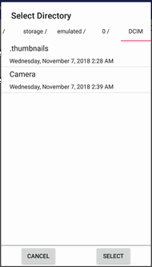
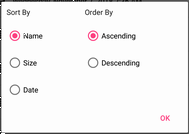
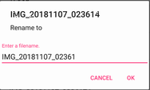
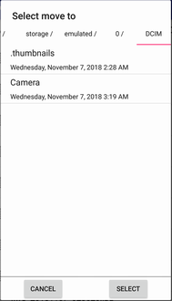
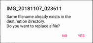
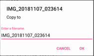
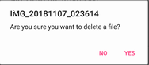

# Android Filer
<a target="_blank" href="https://developer.android.com/reference/android/os/Build.VERSION_CODES.html#ICE_CREAM_SANDWICH"></a>

## Overview
Filer library for android.

## Installation

### Gradle
1. Add repository url to build.gradle(Project)
```groovy
allprojects {
    repositories {
        ...
        maven {
            ...
            url 'https://www.myget.org/F/tkpphr-android-feed/maven/'
        }
    }
}
```

2. Add dependency to build.gradle(Module)
```groovy
dependencies {
    ...
    implementation 'com.tkpphr.android:filer:1.0.0'
    implementation 'com.android.support:design:27.1.1'
}
```

or

### Maven
```xml
...
<repositories>
  ...
  <repository>
    <id>tkpphr-android-feed</id>
    <url>https://www.myget.org/F/tkpphr-android-feed/maven/</url>
  </repository>
</repositories>
...
<dependencies>
  ...
  <dependency>
    <groupId>com.tkpphr.android</groupId>
    <artifactId>filer</artifactId>
    <version>1.0.0</version>
    <type>aar</type>
  </dependency>
  <dependency>
    <groupId>com.android.support</groupId>
    <artifactId>design</artifactId>
    <version>27.1.1</version>
    <type>aar</type>
  </dependency>
</dependencies>
...
```

## Usage

### Utility

#### FileSort
The following types are available. 
- Sort by name (Ascending)
- Sort by name (Descending)
- Sort by date (Ascending)
- Sort by date (Descending)
- Sort by size (Ascending)
- Sort by size (Descending)
```java
import com.tkpphr.android.filer.util.FileSort;

FileSort.NAME_ASC.sort(files:File[]); //or FileSort.NAME_ASC.sort(files:List<File>);
```

#### FileListCache
For use recent file list etc.
```java
import com.tkpphr.android.filer.util.FileListCache;

FileListCache cache=new FileListCache(context,cacheName:String,limit:int, excludeNotExists:boolean, checkDistinct:boolean);
//Create and Update(If "checkDistinct" is true, all items will be unique.)
cache.addFile(filePath:String); // or cache.addFiles(filePaths:String[]);

//Get(If "excludeNotExists" is true, the return value will exclude the file that does not exists.)
List<String> filePathList = cache.getFilePathList(); // or List<File> filePathList = cache.getFiles();

//Delete
boolean isDeleted=cache.delete();

```

### Dialog

#### Select Directory

1. Import class.
```java
import com.tkpphr.android.filer.view.dialog.DirectorySelectorDialog;
```

2. Implement "com.tkpphr.android.filer.view.dialog.DirectorySelectorDialog.OnDirectorySelectedListener" to activity or fragment.
```java
@Override
public void onDirectorySelected(File directory) {
	
}

@Override
public void onDirectorySelectCanceled() {

}
```

3. Open dialog. 
```java
DirectorySelectorDialog.newInstance(title:String,firstDirectory:File).show(fragmentManager,tag);
```



#### Sort File

1. Import class.
```java
import com.tkpphr.android.filer.view.dialog.FileSortDialog;
```

2. Implement "com.tkpphr.android.filer.view.dialog.FileSortDialog.OnFileSortSelectedListener" to activity or fragment.
```java
@Override
public void onFileSortSelected(FileSort fileSort) {
	
}
```

3. Open dialog. 
```java
FileSortDialog.newInstance(defaultSelected:FileSort).show(fragmentManager,tag);
```



#### Rename File

1. Import class.
```java
import com.tkpphr.android.filer.view.dialog.RenameFileDialog;
```

2. Implement "com.tkpphr.android.filer.view.OnRenameFinishedListener" to activity or fragment.
```java
@Override
public void onRenameFinished(File file, boolean isSucceed) {

}
```

3. Open dialog. 
```java
RenameFileDialog.newInstance(file).show(fragmentManager,tag);
```



#### Move File

1. Import class.
```java
import com.tkpphr.android.filer.view.dialog.MoveFileDialog;
```

2. Implement "com.tkpphr.android.filer.view.OnMoveFinishedListener" to activity or fragment.
```java
@Override
public void onMoveFinished(File file, boolean isSucceed) {
	
}
```

3. Open dialog. 
```java
MoveFileDialog.newInstance(file).show(fragmentManager,tag);
```
Select move to directory.



If same filename already exists in destination directory, the following dialog will open.



#### Copy File

1. Import class.
```java
import com.tkpphr.android.filer.view.dialog.CopyFileDialog;
```

2. Implement "com.tkpphr.android.filer.view.OnCopyFinishedListener" to activity or fragment.
```java
@Override
public void onCopyFinished(File file, boolean isSucceed) {
	
}
```

3. Open dialog. 
```java
CopyFileDialog.newInstance(file,copyToAnotherDirectory:boolean).show(fragmentManager,tag);
```



If "copyToAnotherDirectory" is true, the below dialog will open before the above dialog.


#### Delete File
1. Import class.
```java
import com.tkpphr.android.filer.view.dialog.DeleteFileDialog;
```

2. Implement "com.tkpphr.android.filer.view.OnDeleteFinishedListener" to activity or fragment.
```java
@Override
public void onDeleteFinished(File file, boolean isSucceed) {
	
}
```

3. Open dialog. 
```java
DeleteFileDialog.newInstance(file).show(fragmentManager,tag);
```



## License
Released under the Apache 2.0 License.
See LICENSE File.